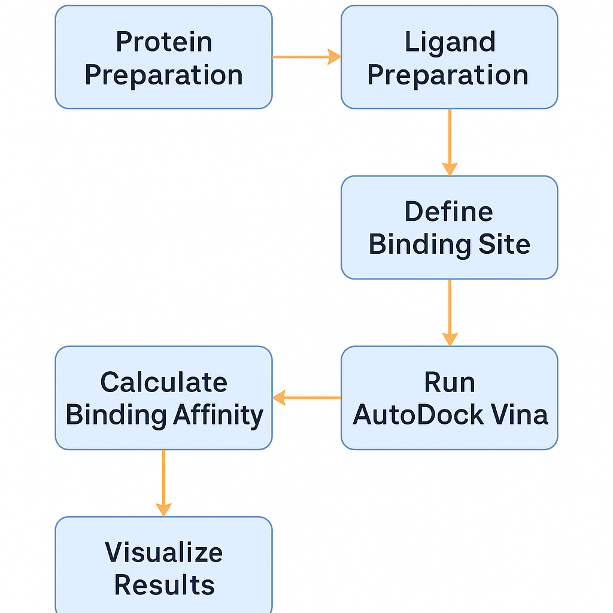

  

<h1 align="center">Virtual Screening of SARS-CoV-2 Mpro (6LU7) Using AutoDock Vina</h1>

  <strong>Automated protein preparation, ligand processing, scoring, and visualization</strong>

  
  
  
  
  

  

# 📌 Project Overview

This repository provides a fully automated docking workflow for the SARS-CoV-2 Main Protease (Mpro, PDB ID: 6LU7), including:

✅ Protein preparation
✅ Ligand docking using AutoDock Vina
✅ Pose visualization in PyMOL
✅ Automated report generation (Word .docx)
✅ Organized results and reusable pipeline

Perfect for:

🔹 Research & coursework
🔹 GitHub portfolio
🔹 Drug discovery learning
🔹 Screening workflow templates

## 🔁 Workflow Overview

  

graph TD
A[Download 6LU7 Protein] --> B[Prepare Protein & Ligand]
B --> C[Run Docking (AutoDock Vina)]
C --> D[Generate Pose Image (PyMOL)]
D --> E[Auto Word Report Generation]

# 📁 Repository Structure
Mpro-6LU7-Virtual-Screening/
├── assets/                # Branding & banner
├── data/                  # Protein & ligand input files
├── docking/
│   ├── poses/             # Docking outputs (.pdbqt)
│   └── logs/              # Log files
├── results/
│   ├── images/            # PyMOL renderings
│   └── report/            # Word report output
├── scripts/
│   ├── run_docking.py
│   ├── auto_visualize.py
│   └── single_ligand_report.py
├── docking/config.txt     # Vina parameters
└── README.md

# 🧬 Target Information
Property	Value
Protein	SARS-CoV-2 Main Protease (Mpro)
PDB ID	6LU7
Organism	SARS-CoV-2
Function	Viral polyprotein cleavage
Drug relevance	Antiviral target

# 🛠 Requirements

✅ AutoDock Vina
✅ PyMOL (optional for visualization)
✅ Python 3.9+
✅ Required Python packages:

pip install python-docx

# ▶️ How to Run the Pipeline
# ✅ 1️⃣ Run Docking
python scripts/run_docking.py

This generates:

docking/poses/pose0_out.pdbqt

# ✅ 2️⃣ Generate Pose Image (PyMOL)

In PyMOL:

run path/to/scripts/auto_visualize.py

# Output:

results/images/pose0.png

# ✅ 3️⃣ Generate Word Report
python scripts/single_ligand_report.py

# Output:

results/report/6LU7_single_ligand_report.docx

# ✅ Results Preview

# 📌 Docked Pose Image

  

# 📌 Automated Report

results/report/6LU7_single_ligand_report.docx

# ⚙️ Docking Parameters (config.txt)
receptor = docking/protein.pdbqt
ligand = data/pose0.pdbqt
center_x = -10
center_y = 12.5
center_z = 68
size_x = 20
size_y = 20
size_z = 20
exhaustiveness = 8

# 🌟 Future Upgrades

✅ Batch screening of multiple ligands
✅ Interaction analysis (H-bonds, residues)
✅ PDF report export
✅ Web UI for job submission

Want upgrades? Open an issue or request!

# 📜 License

This project is licensed under the MIT License — free for academic and personal use.

# 🙌 Acknowledgments

RCSB PDB for structure 6LU7

AutoDock Vina for docking

PyMOL for visualization

# ⭐ Support & Contribution

If you find this useful:

✅ Star ⭐ the repo
✅ Share it on LinkedIn
✅ Fork & contribute

## 👥 Contributors

| Name | Role |
|------|------|
| **Punith Kumar** | Project author, workflow design, scripting, documentation |

## 📚 Citation

If you use this workflow in your research or publication, please cite:

**Punith Kumar**  
*Mpro-6LU7 Virtual Screening Workflow using AutoDock Vina and PyMOL*  
GitHub Repository, 2025  
https://github.com/punith624/Mpro-6LU7-Virtual-Screening

